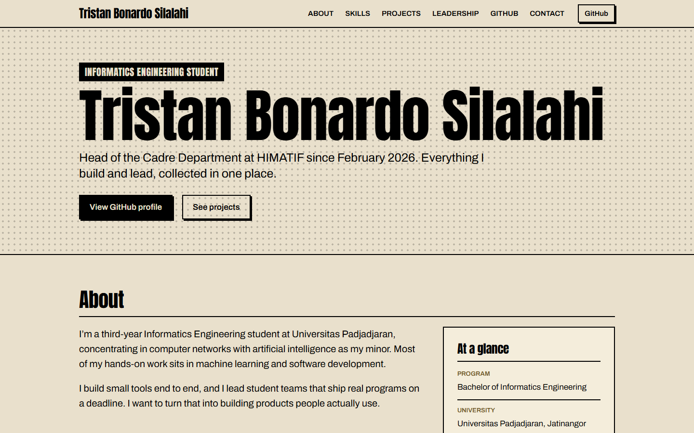
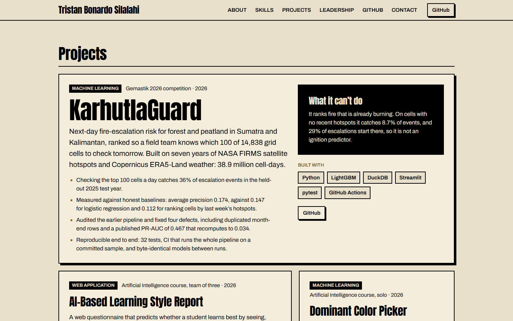
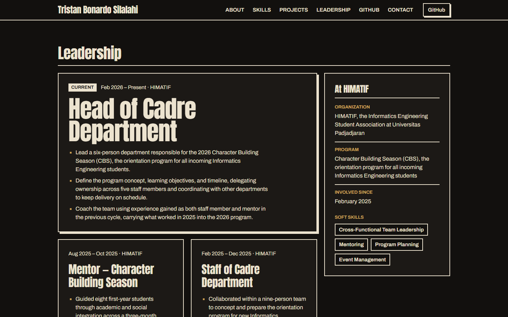
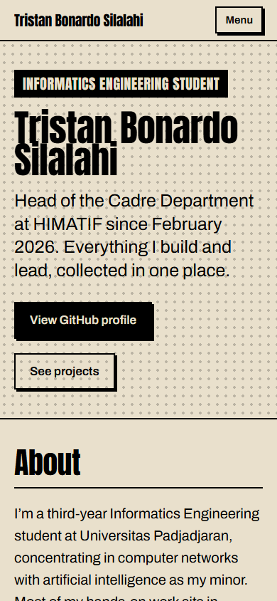

# Portfolio — Tristan Bonardo Silalahi

Personal portfolio website built with Next.js, TypeScript, and Tailwind CSS.

## Project Overview

A single-page personal portfolio that presents Tristan Bonardo Silalahi's
background, technical skills, projects, and leadership experience in one place,
with a public GitHub presence linked throughout.

The purpose of the portfolio is to serve as a professional, self-hosted
introduction — a stable link that can be shared with recruiters, collaborators,
and organizations, and that is kept accurate rather than exhaustive.

### Preview



| Projects, light mode                                                                                                                                                          | Leadership, dark mode                                                                                                                                         |
| ----------------------------------------------------------------------------------------------------------------------------------------------------------------------------- | ------------------------------------------------------------------------------------------------------------------------------------------------------------- |
|  |  |



Screenshots are captured from the production build.

## About

Tristan Bonardo Silalahi is a third-year Informatics Engineering student at
**Universitas Padjadjaran**, concentrating in computer networks with artificial
intelligence as his minor, and currently **Head of the Cadre Department at
HIMATIF** (February 2026 – present). He is based in Sumedang, West Java,
Indonesia.

His hands-on work sits in machine learning and software development: building
small tools end to end, and leading student teams that ship real programs on a
deadline.

Section content is sourced from his CV and his own description of his work. No
biographical details are invented.

## Skills

The skills section groups technical skills by what they are for — languages,
machine learning and data, tools, and foundations — with no proficiency bars or
ratings. Entries come from Tristan's CV, plus a few verified from his public
GitHub repositories: LightGBM, DuckDB, pytest, and GitHub Actions from
`KarhutlaGemastik2026`, and HTML and CSS from his frontend role on the
`Tugas-UAS-AI-kelompok-API` group project. Each entry's source is noted inline
in `lib/skills.ts`.

## Projects

The projects section leads with one featured project at full width, then lists
the rest in an unequal two-column grid. Every card is rendered by the same
`ProjectCard` component from data in `lib/projects.ts`, so adding a project is a
data change only.

Project content comes from the READMEs of Tristan's public repositories, and
every figure on a card appears in its linked repository. Team projects state
his part, taken from the team section of the project's own README. Each card
carries a category, its repository links, and a live demo link when one exists
— none of the projects is deployed yet.

Not shown yet: the face-spoof detection model from the Find IT competition,
which has no public repository, and the `KelompokSorting` C++ coursework, which
is left to the GitHub section.

## Leadership

The leadership section lists Tristan's roles at HIMATIF, the Informatics
Engineering Student Association at Universitas Padjadjaran, newest first, with
the current role at full width. A side panel gives the organization, the
orientation program the roles center on, and the soft skills listed on his CV.

Content comes from his CV, and role bullets keep its wording. Where the CV and
the original project specification differ, the CV is used: the department has
six people including Tristan, the orientation program is the Character Building
Season (CBS), and no attendance figure is claimed, since none is documented.

## GitHub

The GitHub section lists every public, non-fork repository on
`github.com/MFDOOMs`, read from the GitHub REST API, beside a panel with the
account's age, its most-used languages, and a profile link. Star and follower
counts are left out on purpose.

The request runs in a Server Component, never in the browser. Responses are
cached for an hour: the page is prerendered with them and rebuilt in the
background at most once an hour, so visitors never wait on GitHub and traffic
never spends its rate limit. Only public repositories are requested, and only
the fields the page shows are kept.

Every state is handled:

- **Loading** — there is no loading moment for a visitor to see. The data is
  fetched while the page is prerendered, and during the hourly refresh
  visitors keep getting the previous page until the new one is ready. A
  `<Suspense>` placeholder was tried and removed: in a prerendered page it
  ships the placeholder in place and moves the real list behind a script, so
  anything that doesn't run JavaScript would see only the placeholder.
- **Failure** — a GitHub outage, rate limit, or malformed response renders a
  short notice with a link to the profile instead of breaking the page, and the
  reason is logged on the server.
- **Empty** — an account with no public repositories gets a notice rather than
  an empty grid.

## Contact

The contact section closes the page with Tristan's email address at display
size, a button to send an email and one to copy the address, and a side panel
with his LinkedIn and GitHub profiles, location, and time zone.

Only channels he has provided are listed, and he chose to show his email
address publicly. The phone number on his CV is deliberately left off the page.
Contact details live in `lib/site.ts` beside the rest of the site's identity.

Copying uses the Clipboard API in a small Client Component. The result is
announced to screen readers, and if the browser refuses, the button says so
while the address stays selectable on the page.

## Responsive & Accessibility

The page was audited at 375, 768, 1024, and 1440px, in both light and dark
mode, using the locally installed Chrome driven by Playwright. Each run applied
axe-core's WCAG 2.2 AA rules plus best practices, checked for horizontal
overflow, captured every section, dumped the heading outline, and walked the
tab order with the keyboard.

What the audit found, and what changed:

- **Header at 768px** — six section links and the GitHub button squeezed the
  name onto three lines, which spilled out of the fixed-height bar. The inline
  section list now starts at `lg` (1024px), with the menu below it, and the
  name never wraps.
- **Header at 375px** — the name wrapped beside two buttons. Below `sm` the
  GitHub button moves into the menu.
- **Mobile menu** — Escape closed the panel but left keyboard focus on a link
  that had just been hidden. Focus now returns to the Menu button.
- **GitHub headings** — a screen reader's heading list read each repository as
  "Portofolio (opens in a new tab)". The new-tab notice is now a description
  on the link rather than part of its name.
- **Contact** — the email address could break at any character on narrow
  screens and now breaks before the `@`; the LinkedIn and GitHub links, 17px
  tall, now have a larger hit area.
- **Side panels** — the asides in Leadership and GitHub are labelled by their
  headings.

Verified after the changes, at every width in both color schemes: no axe
violations and no horizontal overflow. The page has one `h1` and no skipped
heading levels. Every stop in the tab order shows a focus outline and scrolls
clear of the sticky header, the skip link moves focus to the main content, and
`prefers-reduced-motion` turns smooth scrolling off.

Automated contrast checking can't measure the hero, whose halftone dots sit
behind the text; that text is ink on page stock, far above 4.5:1 in both
schemes. The site has no images.

## SEO & Performance

**Metadata.** The root layout sets the title (58 characters) and description
(154), a canonical link, Open Graph `profile` tags, and a large-image Twitter
card; Next.js fills the Twitter title, description, and image in from the Open
Graph fields. `metadataBase` comes from `lib/site-url.ts` — `SITE_URL` when set,
otherwise Vercel's production domain, otherwise localhost — so no domain is
hard-coded before the site is deployed. The viewport sets `theme-color` for each
color scheme, and telephone detection is off so iOS doesn't turn figures like
"14,838" into phone links.

**Generated files**, all prerendered at build:

- `opengraph-image.tsx` — a 1200×630 link preview drawn as a comic panel, set in
  Anton and Archivo fetched from Google Fonts at build time. If that fetch
  fails, the image falls back to a built-in font instead of failing the build.
- `icon.svg` — a "T" monogram that inverts in dark mode, replacing the stock
  create-next-app favicon. `apple-icon.tsx` draws the same mark at 180px.
- `robots.ts` and `sitemap.ts` — the whole site is crawlable, and the sitemap
  lists its one page.
- Schema.org `Person` JSON-LD in the page, repeating only facts already shown,
  with `<` escaped as the Next.js JSON-LD guide recommends.

**Headings** were already correct: one `h1` and no skipped levels. **Images:**
the page uses none; the only raster images are the generated preview and
touch icon.

**Performance.** The page is prerendered and refreshed at most hourly, fonts are
self-hosted through `next/font` and preloaded, and only the mobile menu and the
copy button ship client-side JavaScript. Lighthouse scores it 97 for
performance on mobile and 100 on desktop, and 100 for accessibility, best
practices, and SEO on both.

Measured against the Phase 10 build over alternating runs, the new metadata
adds about 1.3 KB of compressed HTML (14.0 → 15.4 KB with `next start`'s gzip).
That crosses the first TCP congestion window, which Lighthouse's simulated
slow-4G mobile run shows as roughly 150 ms more to first paint. Under applied
throttling the difference was within run-to-run noise, and Vercel serves Brotli,
which compresses smaller than gzip. The remaining Lighthouse suggestions, about
55 KB of unused and 13 KB of legacy JavaScript, are in the Next.js and React
runtime chunks rather than this project's code.

## Quality Checks

The final pass audited functionality, code quality, performance,
accessibility, and the build, and fixed what it found.

**Functionality.** An automated browser run, Playwright driving the installed
Chrome, clicks through the site at 1440, 768, and 375px. Every header and menu
link lands on its section clear of the sticky header without reloading the
page. The menu opens, closes on Escape, and closes after a choice. Both hero
buttons, Send an email, and Copy address work; the copy is checked against the
real clipboard, along with its visible and announced confirmation. Every
repository and contact link points where it should, the GitHub section renders
the live repositories, the robots, sitemap, preview-image, and icon routes
respond, and no page logs a console error or a failed request. All 44 checks
pass.

External links were also requested directly. Every GitHub URL returns 200.
LinkedIn answers automated requests with its bot-blocking status 999, so that
link was checked against the one embedded in Tristan's CV instead.

**Fixed in this pass:**

- Header links on the 404 page were bare `#section` fragments that resolved
  against the missing URL and went nowhere. They now link to `/#section`, and
  the 404 page is a styled page with a way back instead of Next.js's default.
- With every section built, the per-section `ready` flags, the hero's fallback
  link, and the guards around an empty menu could no longer take effect, so
  they were removed.
- The `target` and `rel` pair for new-tab links, repeated across six components,
  now comes from `lib/links.ts`, and exports that nothing imported are no
  longer exported.
- Header and menu links skip prefetching, since they point at the page that is
  already open.

**Code quality.** TypeScript, ESLint, and Prettier pass. knip finds no unused
files, exports, or dependencies; its one remaining note, an "unlisted"
`postcss`, is a false positive, since the PostCSS config only names the
Tailwind plugin. `npm audit` reports no vulnerabilities. The project has three
runtime dependencies (`next`, `react`, and `react-dom`) and two Client
Components, the mobile menu and the copy button.

**Performance.** The page loads 14.6 KB of compressed HTML, 136 KB of
compressed JavaScript across eight framework chunks, 5.3 KB of CSS, and two
preloaded fonts totalling 46 KB. It has no `` elements; the only raster
images are the generated link preview and touch icon.

**Accessibility.** Re-audited at four widths in both color schemes: no axe
violations, no horizontal overflow, a visible focus outline on every tab stop,
a working skip link, and one `h1` with no skipped heading levels.

**Build.** `next build` succeeds, with every route prerendered as static
content.

## Tech Stack

| Layer      | Technology                                     |
| ---------- | ---------------------------------------------- |
| Framework  | [Next.js 16](https://nextjs.org) (App Router)  |
| Language   | [TypeScript 5](https://www.typescriptlang.org) |
| UI runtime | [React 19](https://react.dev)                  |
| Styling    | [Tailwind CSS 4](https://tailwindcss.com)      |
| Fonts      | Anton & Archivo via `next/font`                |
| Linting    | ESLint 9 with `eslint-config-next`             |
| Formatting | Prettier with `prettier-plugin-tailwindcss`    |
| Hosting    | [Vercel](https://vercel.com)                   |

## Features

- Next.js App Router project with TypeScript in strict mode
- Tailwind CSS 4 styling pipeline via PostCSS
- Self-hosted Anton and Archivo font loading through `next/font`
- Centralized site identity values in `lib/site.ts`
- ESLint and Prettier configured with npm scripts for both
- Design system with role-based color tokens, a modular type scale, and
  reusable UI primitives (see [Design System](#design-system))
- Light and dark palettes driven by `prefers-color-scheme`
- Reduced-motion support and a visible keyboard focus style
- Sticky page header with the name, section anchors, and a GitHub call to action
- Mobile section menu as a keyboard-accessible disclosure below `lg`
- Skip-to-content link as the first focusable element on the page
- Hero section introducing Tristan's identity, with GitHub and project CTAs
- About section pairing a prose introduction with an at-a-glance detail panel
- Skills section grouping technical skills by purpose, without proficiency
  ratings
- Project showcase with a featured project, reusable cards, categories, stated
  team roles, and repository links
- Leadership section tracing Tristan's HIMATIF roles, with the shared context
  and soft skills in a side panel
- GitHub section listing public repositories from the GitHub API, fetched on
  the server with hourly revalidation and loading, failure, and empty states
- Contact section with the email address, send and copy actions, and links to
  LinkedIn and GitHub
- Search and sharing metadata: title, description, canonical link, Open Graph
  and Twitter tags, a generated link-preview image, and theme colors
- Custom favicon and Apple touch icon, `robots.txt`, `sitemap.xml`, and
  schema.org Person structured data
- Styled 404 page inside the site layout, with navigation that still works

The order they were built in is recorded in
[Development Progress](#development-progress).

## Design System

The visual direction is a printed comic page: true black ink on yellowed pulp
stock, content divided into bordered panels separated by gutters, halftone dots
as the only texture. Square corners throughout, hard unblurred shadows, no
gradients.

All tokens are declared in the Tailwind `@theme` block in `app/globals.css`.

### Color

Tokens are named by role rather than hue, so dark mode reassigns five variables
and every utility built on them follows.

| Token        | Light     | Dark      | Use                                        |
| ------------ | --------- | --------- | ------------------------------------------ |
| `ink`        | `#000000` | `#ece3cf` | Text, borders, halftone dots               |
| `paper`      | `#e9e0cc` | `#12100e` | Page stock                                 |
| `plate`      | `#f4eddb` | `#1c1916` | Raised panel fill                          |
| `brass`      | `#8a6a2c` | `#c79a4e` | Accents, borders, large text (3.8:1 light) |
| `brass-deep` | `#6f5522` | `#d8ab5e` | Accents at body size (5.3:1 light)         |

`brass` clears the 3:1 threshold for large text and UI borders but not the 4.5:1
body-text threshold; use `brass-deep` for accent text at body size.

### Typography

Two families with deliberately different jobs:

- **Anton** — ultra-condensed poster face, display sizes only, via the
  `font-display` utility.
- **Archivo** — variable grotesk, every line intended to be read.

The scale is roughly a 1.25 ratio through body sizes and widens at display
sizes, where display steps are fluid via `clamp()`.

| Token       | Size                           | Use                  |
| ----------- | ------------------------------ | -------------------- |
| `text-xs`   | 0.8125rem                      | Fine print           |
| `text-sm`   | 0.9375rem                      | Secondary labels     |
| `text-base` | 1.0625rem                      | Body copy            |
| `text-lg`   | 1.25rem                        | Emphasised body      |
| `text-xl`   | 1.5625rem                      | Lead paragraphs      |
| `text-2xl`  | 2rem                           | Panel headings       |
| `text-3xl`  | 2.625rem                       | Section headings     |
| `text-4xl`  | `clamp(2.75rem, 6vw, 4.25rem)` | Page-level statement |
| `text-5xl`  | `clamp(3.25rem, 11vw, 7.5rem)` | Name, once per page  |

Reading measure is capped near 62 characters.

### Spacing

Semantic names layered over the default 4px scale:

| Token     | Value                        | Use                                                |
| --------- | ---------------------------- | -------------------------------------------------- |
| `gutter`  | 1.25rem                      | Gap between panels, and page margin                |
| `panel`   | 1.75rem                      | Panel inner padding                                |
| `section` | `clamp(2.5rem, 6vw, 4.5rem)` | Vertical rhythm between sections                   |
| `header`  | 3.5rem                       | Sticky header height, and the anchor scroll offset |

`gutter` doubles as the page margin so panels align with the page edge.

### Breakpoints

Tailwind's defaults are kept, since they already line up with the widths the
project targets:

| Breakpoint | Min width      |
| ---------- | -------------- |
| _(base)_   | 375px and up   |
| `sm`       | 40rem / 640px  |
| `md`       | 48rem / 768px  |
| `lg`       | 64rem / 1024px |
| `xl`       | 80rem / 1280px |

### Primitives

| Component    | Purpose                                                         |
| ------------ | --------------------------------------------------------------- |
| `Container`  | Page-width constraint; padding matches the panel gutter         |
| `Panel`      | Comic panel — `plate`, `paper`, or `ink` tone; optional padding |
| `Section`    | Vertical rhythm plus the section heading and its rule           |
| `Button`     | `<button>` in `solid`, `outline`, or `quiet` variant            |
| `ButtonLink` | `<a>` styled as a control, for navigation and external links    |
| `TagList`    | Wrapping row of bordered labels, for skills and project tech    |
| `CopyButton` | Copies a value to the clipboard and announces whether it worked |

Two custom utilities, `halftone` and `halftone-coarse`, apply the dot field.

### Animation

Motion answers a person's action and is never decoration. Controls model a
physical press: at rest they cast a 3px printed shadow, hover lifts them 2px off
the page and deepens the shadow to 5px, and pressing pushes them flat into the
shadow's place. The default transition is 120ms. `prefers-reduced-motion:
reduce` collapses all transitions and animations.

## Navigation

The portfolio is a single page, so navigation is a set of in-page anchors
rather than routes. `lib/nav.ts` declares the six sections once, in page order,
and the header and the mobile menu both render from that list.

While the page was built one section per phase, each entry carried a `ready`
flag so the navigation never linked to a section that didn't exist yet. With
every section built, that gate was removed in the final quality pass.

Section links are `next/link` links to `/#section` rather than bare `#section`
fragments. On the home page they jump in place without reloading; from any other
URL, such as the 404 page, they return to the home page at that section, where
a bare fragment would have scrolled nowhere.

The section list hides below `lg` with `max-lg:hidden` — one utility stating
the intent — rather than `hidden lg:block`, which sets a default and then
overrides it. Below `sm` the header's GitHub button moves into the menu too, so
the name always fits on one line.

Anchor targets clear the sticky header via `scroll-padding-top` on the scroll
container, sized from the same `--spacing-header` token the header uses.

## Project Structure

```text
.
├── app/                  # Next.js App Router routes and layouts
│   ├── apple-icon.tsx    # 180px home-screen icon, generated at build
│   ├── globals.css       # Tailwind entry point, design tokens, base styles
│   ├── icon.svg          # Favicon: "T" monogram with a dark-mode variant
│   ├── layout.tsx        # Root layout: fonts, metadata, viewport, page shell
│   ├── not-found.tsx     # 404 page inside the site layout
│   ├── opengraph-image.tsx # Link-preview image, generated at build
│   ├── page.tsx          # Home page and its structured data
│   ├── robots.ts         # robots.txt, pointing at the sitemap
│   └── sitemap.ts        # sitemap.xml for the single page
├── components/
│   ├── projects/         # Project showcase building blocks
│   │   └── ProjectCard.tsx # One project: story, evidence, stack, links
│   ├── sections/         # Page sections, in page order
│   │   ├── About.tsx     # Prose introduction and the detail panel
│   │   ├── Contact.tsx   # Email, send and copy actions, other channels
│   │   ├── GitHub.tsx    # Public repositories from the GitHub API
│   │   ├── Hero.tsx      # Name, role, and the primary calls to action
│   │   ├── Leadership.tsx # HIMATIF roles and the context they share
│   │   ├── Projects.tsx  # Featured project, then the rest
│   │   └── Skills.tsx    # Technical skills, grouped by purpose
│   ├── site/             # Page shell
│   │   ├── MobileNav.tsx # Section menu below `lg` (Client Component)
│   │   └── SiteHeader.tsx # Sticky header: name, section links, GitHub button
│   └── ui/               # Design system primitives
│       ├── Button.tsx    # Button and ButtonLink
│       ├── Container.tsx # Page-width constraint
│       ├── CopyButton.tsx # Copy to clipboard with an announced result (Client Component)
│       ├── Panel.tsx     # Comic panel
│       ├── Section.tsx   # Section rhythm and heading
│       └── TagList.tsx   # Row of bordered labels
├── docs/
│   └── screenshots/      # README preview images, from the production build
├── lib/                  # Framework-agnostic helpers and shared data
│   ├── about.ts          # About-section prose and reference details
│   ├── cn.ts             # Class name joiner
│   ├── github.ts         # Server-side GitHub API client, cached hourly
│   ├── google-font.ts    # TrueType Google Fonts for generated images
│   ├── leadership.ts     # Roles, organization context, and soft skills
│   ├── links.ts          # Shared attributes for links that open a new tab
│   ├── nav.ts            # Section list shared by the header and the menu
│   ├── projects.ts       # Project content, each figure from its repository
│   ├── site.ts           # Site identity: name, GitHub, email, LinkedIn, location
│   ├── site-url.ts       # Absolute site origin, from SITE_URL or Vercel
│   └── skills.ts         # Skill groups, each entry with its source
├── eslint.config.mjs     # ESLint flat config
├── next.config.ts        # Next.js configuration
├── postcss.config.mjs    # PostCSS pipeline (Tailwind CSS)
├── tsconfig.json         # TypeScript configuration, `@/*` path alias
├── .prettierrc.json      # Prettier configuration
├── AGENTS.md             # Next.js-generated guidance for AI coding agents
├── CLAUDE.md             # Points Claude Code at AGENTS.md
└── Development Workflow & Progress Tracking.md # The 13-phase build plan
```

Each page section lives in `components/sections/`, and its anchor is listed in
`lib/nav.ts`. There is no `public/` folder in the repository: the icons and the
link-preview image are generated from files in `app/`.

## Getting Started

Requires Node.js 20.9 or later, the minimum for Next.js 16.

```bash
npm install
npm run dev
```

The development server runs at [http://localhost:3000](http://localhost:3000).

### Available Scripts

| Command                | Description                                   |
| ---------------------- | --------------------------------------------- |
| `npm run dev`          | Start the development server                  |
| `npm run build`        | Create a production build                     |
| `npm run start`        | Serve the production build locally            |
| `npm run lint`         | Run ESLint                                    |
| `npm run lint:fix`     | Run ESLint and apply fixable corrections      |
| `npm run typecheck`    | Type-check the project without emitting files |
| `npm run format`       | Format the project with Prettier              |
| `npm run format:check` | Verify formatting without writing changes     |

## Environment Variables

The site builds and runs with **no environment variables**; both below are
optional.

| Variable       | Required | Purpose                                                                                                                                                                                                                                                                   |
| -------------- | -------- | ------------------------------------------------------------------------------------------------------------------------------------------------------------------------------------------------------------------------------------------------------------------------- |
| `GITHUB_TOKEN` | No       | Authenticates the GitHub section's API requests, raising GitHub's rate limit from 60 to 5,000 requests an hour. Recommended on Vercel, whose build machines share IP addresses.                                                                                           |
| `SITE_URL`     | No       | The site's absolute origin, e.g. `https://example.com`, used for the canonical link, Open Graph image, sitemap, and robots file. Defaults to Vercel's production domain on Vercel builds and to `http://localhost:3000` locally; set it once a custom domain is attached. |

Only public data is read, so a fine-grained token with read-only access to
public repositories is enough. Neither variable has a `NEXT_PUBLIC_` prefix, so
Next.js keeps both on the server and never bundles them into browser
JavaScript.

`lib/site-url.ts` also reads `VERCEL_PROJECT_PRODUCTION_URL`, which Vercel sets
on every build by itself; it is never added by hand.

Real secrets and API keys are never committed to this repository or written into
this README; `.env*` files are excluded via `.gitignore`.

## Deployment

The project deploys to [Vercel](https://vercel.com) without a configuration
file: Vercel detects Next.js and uses its default build.

1. **Create a GitHub token** (recommended). Vercel's build machines share IP
   addresses, and GitHub allows only 60 unauthenticated API requests an hour per
   address. A rate-limited build makes the GitHub section show its failure
   notice until the next hourly refresh. At
   `github.com/settings/personal-access-tokens`, generate a fine-grained token
   with repository access set to _Public repositories (read-only)_ and no other
   permissions.
2. **Import the repository.** In the Vercel dashboard, choose **Add New →
   Project** and import `MFDOOMs/Portofolio`. The project name becomes the
   default address, `<project-name>.vercel.app`, so choose the name you want in
   the URL. Leave the framework preset (Next.js), root directory, and build
   settings at their defaults.
3. **Add the environment variable.** Under **Environment Variables**, add
   `GITHUB_TOKEN` with the token as its value. `SITE_URL` isn't needed: Vercel
   supplies the production domain at build time.
4. **Deploy.** Afterwards, every push to `main` redeploys production, and
   pushes to other branches get their own preview URLs.
5. **Attach a custom domain** (optional) under **Settings → Domains**, then set
   `SITE_URL` to it and redeploy so the canonical link, sitemap, and link
   preview use it.

After the first deployment, check the live site:

- The GitHub section lists the repositories rather than its failure notice.
- `/robots.txt` and `/sitemap.xml` show the production domain, not `localhost`.
- `/opengraph-image` renders, and a link shared in a messaging app shows it.
- The header links, the Menu button, and Copy address work.

A production build can be verified locally first:

```bash
npm run build
npm run start
```

## Development Progress

- [x] Phase 1 — Project setup
- [x] Phase 2 — Design system
- [x] Phase 3 — Hero & navigation
- [x] Phase 4 — About section
- [x] Phase 5 — Skills section
- [x] Phase 6 — Projects section
- [x] Phase 7 — Leadership & experience
- [x] Phase 8 — GitHub integration
- [x] Phase 9 — Contact section
- [x] Phase 10 — Responsive & accessibility
- [x] Phase 11 — SEO & performance
- [x] Phase 12 — Final testing
- [x] Phase 13 — Vercel deployment preparation
